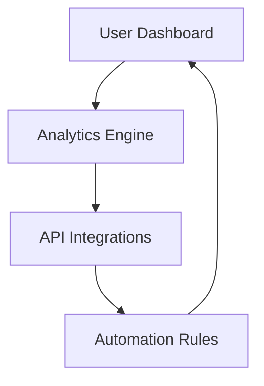

## Overview

Finzor delivers powerful financial tools designed for modern users. As an emerging fintech platform, it focuses on intuitive dashboards, real-time analytics, and seamless integrations. You gain insights into your finances, automate workflows, and scale operations effortlessly. Early adopters benefit from beta access to cutting-edge features that evolve based on community feedback.

<Callout kind="info">
  Finzor is in active development. Check the [dashboard](https://ui2.finzor.dev) for the latest updates.
</Callout>

## Core Features

Explore Finzor's foundational capabilities through these key features.

<Columns cols={3}>
  <Card title="Real-Time Analytics" icon="bar-chart-3" href="#analytics">
    Track portfolio performance, expenses, and trends with live data visualizations. Receive instant alerts for market shifts.
  </Card>
  <Card title="Automated Workflows" icon="zap" href="#workflows">
    Set up rules for transactions, budgeting, and reporting. Integrate with banks and crypto exchanges without code.
  </Card>
  <Card title="Secure API Integrations" icon="shield" href="#integrations">
    Connect Finzor to your apps using RESTful APIs. Handle authentication and data syncing securely.
  </Card>
</Columns>

## Common Use Cases

Tailor Finzor to your needs with these practical scenarios.

<Tabs>
  <Tab title="Personal Finance" icon="user">
    Manage daily budgets and investments.

    <Steps>
      <Step title="Connect Accounts" icon="link">
        Link your bank and investment accounts via OAuth.
      </Step>
      <Step title="Set Goals" icon="target">
        Define savings targets and automate transfers.
      </Step>
      <Step title="Monitor Progress" icon="activity">
        View dashboards for spending insights.
      </Step>
    </Steps>
  </Tab>
  <Tab title="Business Analytics" icon="briefcase">
    Analyze cash flow and forecast revenues.

    <Steps>
      <Step title="Import Data" icon="upload">
        Upload CSV files or connect via API.
      </Step>
      <Step title="Run Reports" icon="file-text">
        Generate custom financial statements.
      </Step>
      <Step title="Share Insights" icon="share-2">
        Export reports or embed in tools like Slack.
      </Step>
    </Steps>
  </Tab>
</Tabs>

## API Integrations

Integrate Finzor into your applications with simple API calls.

<CodeGroup tabs="JavaScript,Python">
  ```javascript
  const response = await fetch('https://api.example.com/v1/analytics/portfolio', {
    headers: {
      'Authorization': `Bearer ${YOUR_API_KEY}`,
      'Content-Type': 'application/json'
    }
  });
  const data = await response.json();
  console.log(data.balance);
  ```
  ```python
  import requests

  headers = {
      'Authorization': f'Bearer {YOUR_API_KEY}',
      'Content-Type': 'application/json'
  }
  response = requests.get('https://api.example.com/v1/analytics/portfolio', headers=headers)
  data = response.json()
  print(data['balance'])
  ```
</CodeGroup>

<ParamField path="userId" param-type="string" required="true">
  Your unique Finzor user identifier.
</ParamField>

<ParamField header="Authorization" param-type="string" required="true">
  Bearer token for secure access.
</ParamField>

## How Features Address Your Needs

Finzor's design solves common pain points:

| Need                  | Finzor Solution                  | Benefit                          |
|-----------------------|----------------------------------|----------------------------------|
| Data Silos            | Unified Dashboard                | Single view of all finances      |
| Manual Tracking       | Automation Rules                 | Save hours weekly                |
| Security Concerns     | End-to-End Encryption            | Peace of mind for sensitive data |
| Scalability           | API-First Architecture           | Grow without limits              |

<Callout kind="tip">
  Start with the free tier to test core features before upgrading.
</Callout>

## Roadmap

Discover upcoming enhancements.

<ExpandableGroup>
  <Expandable title="Q4 2024: AI Insights" default-open="true">
    Machine learning predictions for market trends and personalized advice.
  </Expandable>
  <Expandable title="Q1 2025: Multi-Currency Support">
    Handle global transactions with real-time exchange rates.
  </Expandable>
  <Expandable title="Q2 2025: Collaboration Tools">
    Team workspaces for shared financial planning.
  </Expandable>
</ExpandableGroup>



This architecture ensures seamless data flow across features. Join the beta at [ui2.finzor.dev](https://ui2.finzor.dev) to experience it firsthand.